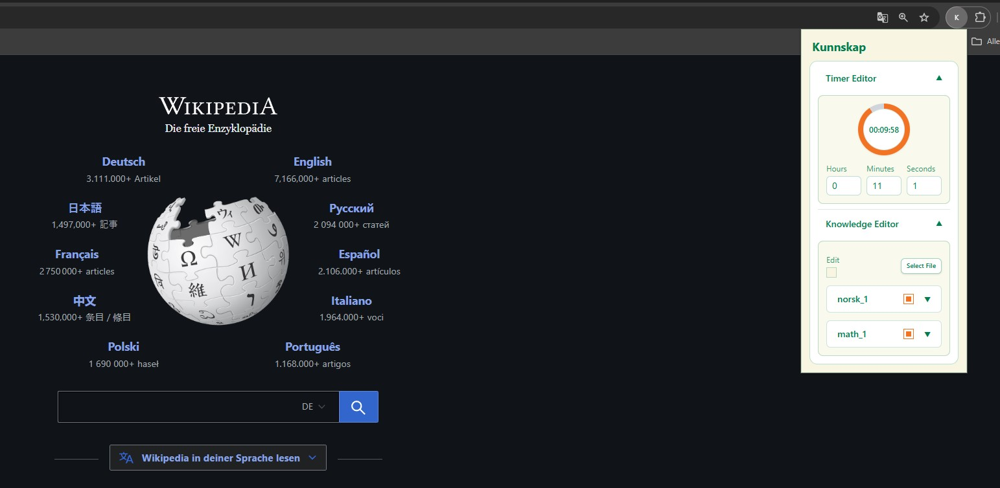
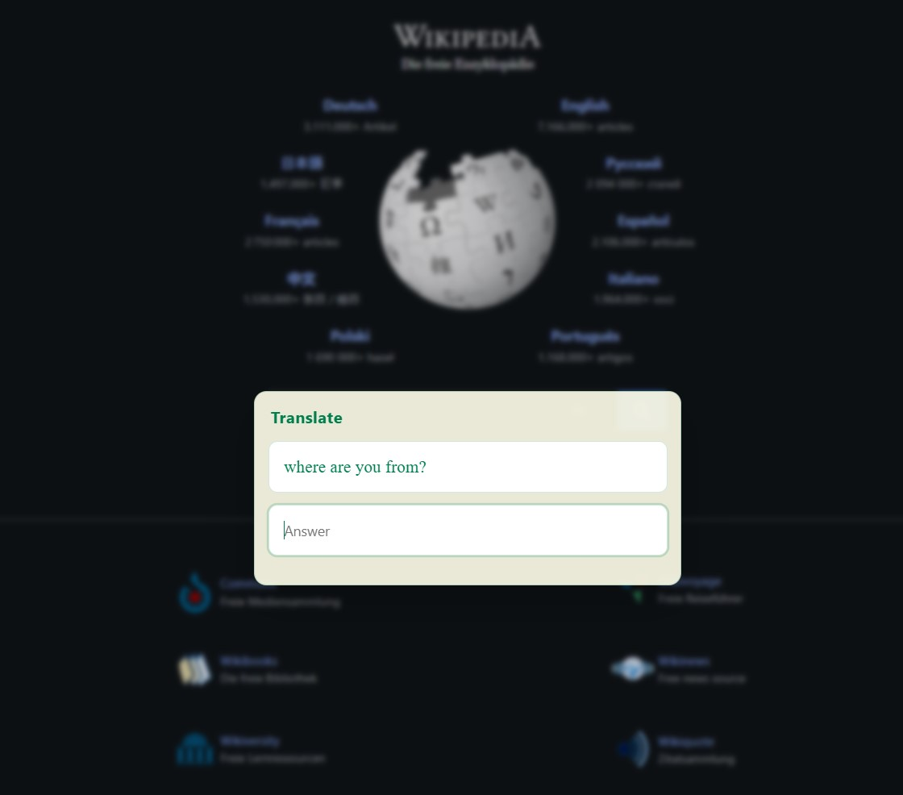

# Kunnskap

Kunnskap is a browser extension that interrupts unproductive, endless browsing with short knowledge checks.

Set a timer and knowledgebase, browse as usual, and when the timer expires Kunnskap injects a question into your active tabs, blocking everything until the question is completed.

[](https://youtu.be/XdMY-2uppKs)

## What It Does

- Runs a configurable countdown timer.
- Pops up a random question (you selected before) when the timer expires.
- Supports text + inline LaTeX.
- Imports entries from CSV.
- Lets you activate/deactivate specific entries.


## Installation

From the repository root:

```bash
cd chrome
npm install
```

## Load As Unpacked Extension

1. Download and unzip the latest release.
2. Open your Chrome browser extension page: `chrome://extensions`
3. Enable **Developer mode**.
4. Click **Load unpacked**.
5. Select the unzipped `kunnskap_vX.X.X/dist` folder.

## How To Use

1. Click the extension icon to open the popup.
2. In **Timer Editor**, set hours/minutes/seconds.
3. Add or import knowledge in **Knowledge Editor**.
4. Start the timer.
5. When time is up, a question modal appears on all tabs.
6. Enter the correct answer to continue browsing.
7. After 3 wrong tries the correct answer is displayed.


## CSV Import Format

The importer expects a header row with these columns:

- `name`: category name used for grouping.
- `question`: question text.
- `answer`: expected answer text.
- `category`: label shown in modal title.
- `bidirectional`: `true/false`, `1/0`, `yes/no`, `y/n`.
- `active`: `true/false`, `1/0`, `yes/no`, `y/n`.

Example:

```csv
name;question;answer;bidirectional;active;category
norsk_1;no;nei;TRUE;TRUE;Vocabulary
norsk_1;speak;snakke;TRUE;TRUE;Vocabulary
norsk_1;å;to;FALSE;TRUE;Vocabulary
norsk_1;gå;go;FALSE;TRUE;Vocabulary
```

You can include LaTeX in question/answer using `$...$` segments.

Sample file: [assets/kunnskap_example.csv](assets/kunnskap_example.csv).


## Screenshots






## License

MIT. See [LICENSE](LICENSE).
